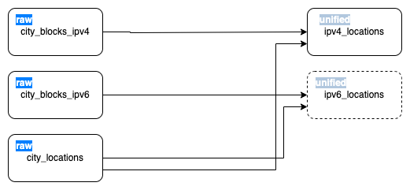

# Transformações GeoIP2 BigQuery

Este repositório cobre as transformações aplicadas aos dados de GeoIP2 da MaxMind. Para entender como funciona a Extração e Carga desses dados no BigQuery, consulte o [repositório no Gitlab](https://gitlab.globoi.com/bigdata/datalake/geoip2-cities).

## Introdução

Este pipeline é completamente desenvolvido no ambiente da ferramenta Dataform (BigQuery para BigQuery). Portanto, as camadas de staging e unified são criadas através do Dataform. A camada raw é criada pelo pipeline de Extração e Carga.


#### Descricão das Camadas

- **Camada raw**: possui os dados extraidos da Maxmind sem nenhum tipo de tratamento;
- **Camada staging**: possui as tabelas city_blocks_ipv[4|6] com duas novas colunas que representam o IP inicial e o IP final de uma rede (campo network). Por exemplo, para uma rede ``10.0.0.0/24``, o IP inicial será ``	10.0.0.0`` e o IP final será ``	10.0.0.255``, dados que a máscara de sub-rede ``24`` engloba 256 endereços;
- **Camada unified**: Une as tabelas staging com a tabela city_locations. Ou seja, agrega a informação de IP com a informação de geolocalização.



> Nota: Ainda não temos a camada unified para a versão IPv6. Pois o Bigquery não possui funções nativas que permitem encontrar IP inicial e final. Estamos trabalhando no desenvolvimento de uma UDF para entregar esta tabela.

## Estrutura do Projeto
```
├── dataform.json
├── definitions
│   ├── raw/
│   └── unified/
├── docs
├── environments.json
├── package-lock.json
├── package.json
└── readme.md
```
Além dos arquivos de configuração utilizados pelo *npm* (package.json e package-lock.json), temos a estrutura descrita a seguir:
- **definitions**: definições das transformações em cada camda. Também incluir os testes de qualidade de cada camada;
- **docs**: documentação técnica do projeto
- **environments.json**: definições dos ambientes no escopo do dataform, como variáveis, agendamentos e tags a serem executadas.

## Detalhamento Técnico

- Os recursos foram criados via console pois não existe suporte para CICD dentro do plano Github utilizado atualmente.

- O pipeline no Dataform é disparado via Google Cloud Composer, na DAG definida no pipeline de extração e carga.

- Os dados estão configurados para terem validade de 90 dias.

## Permissões

Para executar com sucesso, o Dataform necessidade da permissão **BigQuery Admin**, dada na service account indicada [no momento da criação do projeto](https://tvglobocorp.sharepoint.com/sites/DataProducts/SitePages/Configura%C3%A7%C3%A3o-de-uso.aspx).


## Como solicitar acesso

- Acesso de leitura ao dataset de produção via [Acesso Globo](https://acesso.g.globo)
  - Grupo: [To be defined]
- Não damos acesso ao dado raw no GCS

## Dúvidas

Consultar o time ``Big Data - Data Products`` no Slack ou no Teams:
* Teams: canal [Data Products - Big Data](https://teams.microsoft.com/l/team/19%3a3AVZPVRofrw5OvipP_mHBNhjXs7U0BPgfiUUlqWX4Cw1%40thread.tacv2/conversations?groupId=e2df05e3-ea91-437d-8dd3-27f00663e8b0&tenantId=a7cdc447-3b29-4b41-b73e-8a2cb54b06c6)
* Slack: canal [#bigdata-data-products](https://globo.slack.com/archives/C04DJ6YFNRH)